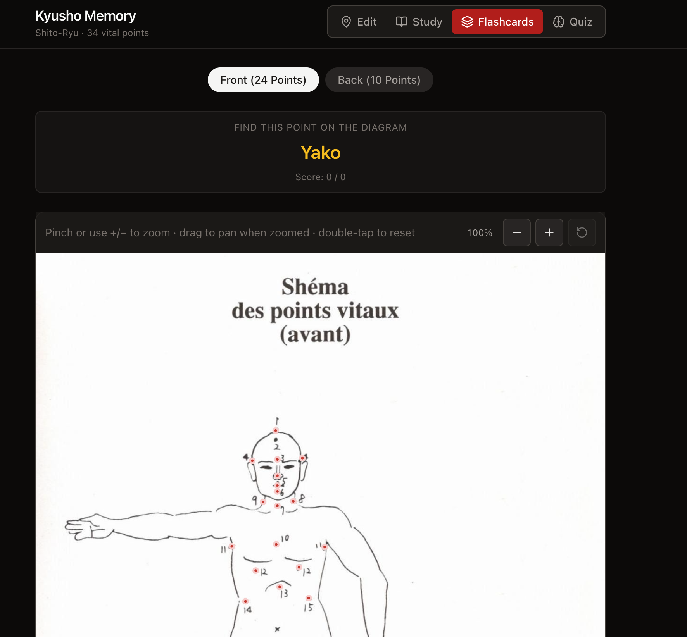

# Kyusho Memory — Shito-Ryu Vital Points

A memory trainer for the 34 **Shito-Ryu kyusho** __e(vital points)__.

Preview: [hasantayyar.github.io/karate-vital-points/](https://hasantayyar.github.io/karate-vital-points/)

## Stack

- React 19 + Vite
- Tailwind CSS v4
- Lucide React icons

## Setup

```bash
npm install
npm run build
npm run dev
```

Preview:


## Creating `points.json`

1. Add your diagram as `public/vital-points.jpeg`.
2. Run `npm run dev` and open the app.
3. Use **Edit** mode (default on first load):
   - Toggle **front** / **back** for each side of the body.
   - Select a point name, then **click** its location on the image.
   - Use **Next** until all 24 front and 10 back points are placed.
4. Click **Copy points.json** or **Download**, then replace `src/data/points.json`.

Coordinates are **percentages from the top-left** of the image (`0`–`100`), stored in a `positions` array. Use **multiple entries** for points that appear in more than one place (e.g. Shichu, Futto).

```json
{
  "id": "front-7",
  "order": 7,
  "name": "Shichu",
  "positions": [
    { "x": 38.2, "y": 22.1 },
    { "x": 61.8, "y": 22.1 }
  ]
}
```

Progress is auto-saved in the browser until you export. Legacy `{ "x", "y" }` entries are converted automatically on load.

## Modes

- **Study** — tap dots to see names
- **Flashcards** — name prompt, click the correct dot; missed points are weighted higher via `localStorage`
- **Quiz** — 10-question round mixing **Locate** (name → tap dot, like flashcards) and **Identify** (pulsing dot → pick the name from four choices); results screen at the end

### Local production preview

```bash
npm run build:pages   # uses /karate/ base (change in package.json if your repo name differs)
npm run preview
```

Open `http://localhost:4173/karate/`

Dev: `npm run dev` → `http://localhost:5173/karate/`
